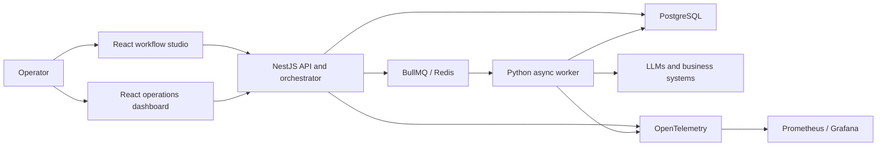

# AgentFlow

[](https://github.com/bilLkarkariy/AgentFlow/actions/workflows/ci.yml)

AgentFlow is a fullstack monorepo for building, running, and observing agentic workflows in production.

## What it does

- Compose and run agent workflows
- Execute flows via API/runtime services
- Monitor usage, execution logs, and operational metrics
- Connect business systems (OAuth/integrations)

## Architecture



The API owns workflow definitions, execution state and integrations. Long-running work is delegated to asynchronous workers, while telemetry provides an operational view across services.

## Monorepo structure

- `api/`: NestJS API (REST/WebSocket, integrations, orchestration)
- `web/studio/`: flow editor and operator UI
- `web/dashboard/`: metrics and analytics dashboard
- `worker/`: Python async/background task worker
- `infra/`: local/dev infrastructure definitions

## Tech stack

- TypeScript, Node.js, pnpm workspaces
- NestJS, BullMQ, PostgreSQL/SQLite
- React + Vite (studio/dashboard)
- OpenTelemetry + Prometheus/Grafana
- Jest/Vitest/Playwright/Cypress testing

## Production-oriented design

- Queue-backed execution separates API latency from long-running agent work
- Workflow payloads use a documented JSON schema
- Observability spans API, workers and infrastructure
- CI builds the services and runs unit and API end-to-end tests
- Infrastructure definitions support local development and deployment

Further reading:

- [`docs/rfc/agent_dsl_rfc.md`](docs/rfc/agent_dsl_rfc.md) — workflow DSL
- [`docs/flow-payload.schema.json`](docs/flow-payload.schema.json) — payload contract
- [`api/src/docs/architecture/worker.md`](api/src/docs/architecture/worker.md) — worker architecture
- [`docs/ui/design-system.md`](docs/ui/design-system.md) — interface system

## Security and compliance notes

- Secrets are injected through environment variables.
- Terraform state, local kube configs, and private keys must never be versioned.
- All historical state artifacts were removed from this publicized history.

## Quick start

```bash
pnpm install
pnpm --filter api run start:dev
pnpm --filter web/studio run dev
pnpm --filter web/dashboard run dev
python3 worker/agentflow_worker.py
```

## Testing

```bash
pnpm --filter api run test
pnpm --filter web/studio run test
pnpm --filter web/dashboard run test
```

## Status

Public technical showcase repository focused on architecture, reliability, and production-ready agent workflow patterns.
