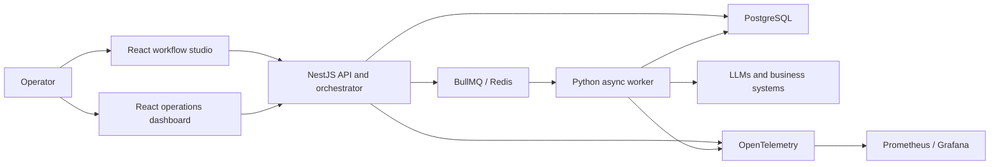
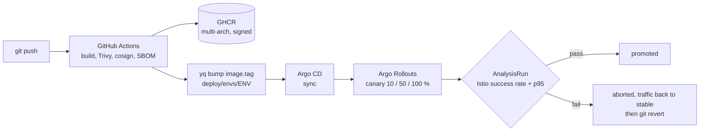

# AgentFlow

[](https://github.com/bilLkarkariy/AgentFlow/actions/workflows/ci.yml)

AgentFlow is a fullstack monorepo for building, running, and observing agentic workflows in production.

## What it does

- Compose and run agent workflows
- Execute flows via API/runtime services
- Monitor usage, execution logs, and operational metrics
- Connect business systems (OAuth/integrations)

## Architecture



The API owns workflow definitions, execution state and integrations. Long-running work is delegated to asynchronous workers, while telemetry provides an operational view across services.

## Monorepo structure

- `api/`: NestJS API (REST/WebSocket, integrations, orchestration)
- `web/studio/`: flow editor and operator UI
- `web/dashboard/`: metrics and analytics dashboard
- `worker/`: Python async/background task worker
- `infra/`: Terraform for the kind and EKS environments (the GitOps tree lives in `deploy/`)

## Tech stack

- TypeScript, Node.js, pnpm workspaces
- NestJS, BullMQ, PostgreSQL/SQLite
- React + Vite (studio/dashboard)
- OpenTelemetry + Prometheus/Grafana
- Jest/Vitest/Playwright/Cypress testing

## Production-oriented design

- Queue-backed execution separates API latency from long-running agent work
- Workflow payloads use a documented JSON schema
- Observability spans API, workers and infrastructure
- CI builds the services and runs unit and API end-to-end tests
- Infrastructure definitions support local development and deployment

Further reading:

- [`docs/rfc/agent_dsl_rfc.md`](docs/rfc/agent_dsl_rfc.md) — workflow DSL
- [`docs/flow-payload.schema.json`](docs/flow-payload.schema.json) — payload contract
- [`api/src/docs/architecture/worker.md`](api/src/docs/architecture/worker.md) — worker architecture
- [`docs/ui/design-system.md`](docs/ui/design-system.md) — interface system

<!-- platform:start -->

## Platform and operations (DevOps showcase)

AgentFlow ships with the platform it runs on: a complete GitOps delivery chain
that runs identically on a laptop (kind) and on ephemeral AWS EKS. Terraform
creates the cluster and Argo CD; Argo CD installs everything else from
`deploy/`; CI never touches a cluster.

| Concern | Tool | Where it lives |
|---|---|---|
| Cluster | kind (local) / EKS (aws) | `infra/envs/{local,aws-demo}` |
| Bootstrap | Terraform + one root Application | `infra/`, `deploy/platform/bootstrap` |
| GitOps | Argo CD, `ApplicationSet`, sync waves | `deploy/argocd`, `deploy/platform` |
| Packaging | one golden-path Helm chart for all four services | `deploy/charts/agentflow-service` |
| Progressive delivery | Argo Rollouts canary + Prometheus `AnalysisRun` | `deploy/platform/argo-rollouts` |
| Service mesh | Istio sidecar, mTLS STRICT, Kiali | `deploy/platform/istio` |
| Observability | Prometheus, Grafana, Loki, Tempo, OpenTelemetry | `deploy/platform/{kube-prometheus-stack,loki,tempo,otel-collector}` |
| Policy | Kyverno: no `latest`, non-root, limits, cosign signatures | `deploy/platform/kyverno` |
| Secrets | External Secrets Operator + AWS Secrets Manager (IRSA) | `deploy/platform/external-secrets` |
| Supply chain | multi-arch build, Trivy, cosign keyless, SBOM attestation | `.github/workflows/build-images.yml` |
| Data | CloudNativePG (local) / RDS (aws), Redis, RabbitMQ | `deploy/charts/agentflow-infra` |

```sh
make local-up     # the whole platform on this laptop, free, ~15 min
make aws-up       # the same platform on real EKS, ~25 min, ~0.24 USD/hour
make aws-down     # destroy it, then `make aws-check-clean` proves it is gone
```

The delivery loop:



Start here: **[`docs/ops/README.md`](docs/ops/README.md)** — runbooks, cost, the
10-minute demo script and the production talking points. The decisions behind
all of it, with their alternatives, are in
**[`docs/adr/README.md`](docs/adr/README.md)**. The GitOps tree is documented in
[`deploy/README.md`](deploy/README.md) and the Terraform in
[`infra/README.md`](infra/README.md).

<!-- platform:end -->

## Security and compliance notes

- Secrets are injected through environment variables.
- Terraform state, local kube configs, and private keys must never be versioned.
- All historical state artifacts were removed from this publicized history.

## Quick start

```bash
pnpm install
pnpm --filter api run start:dev
pnpm --filter web/studio run dev
pnpm --filter web/dashboard run dev
python3 worker/agentflow_worker.py
```

## Testing

```bash
pnpm --filter api run test
pnpm --filter web/studio run test
pnpm --filter web/dashboard run test
```

## Status

Public technical showcase repository focused on architecture, reliability, and production-ready agent workflow patterns.
