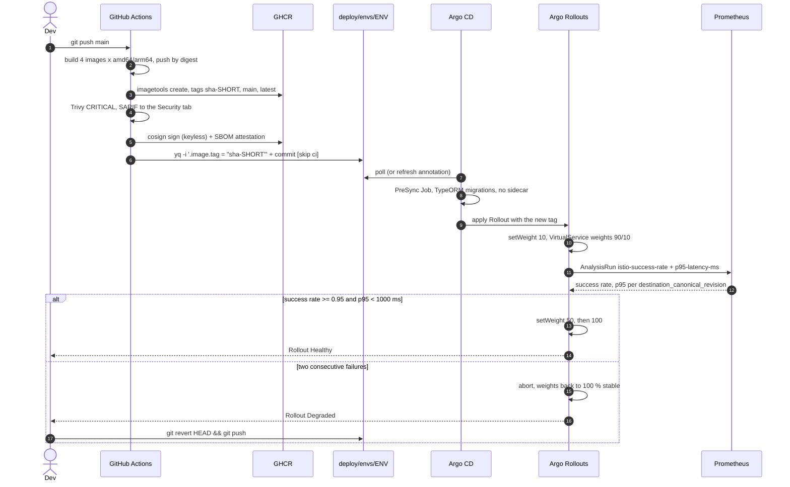

# Architecture

Three pictures and one table. The pictures answer "where does a request go",
"what installs what" and "how does a commit become a pod". The table is the
contract every work package writes against.

- [AWS topology](#1-aws-topology)
- [In-cluster layers, by sync wave](#2-in-cluster-layers-by-sync-wave)
- [A commit becomes a pod](#3-a-commit-becomes-a-pod)
- [Contracts](#4-contracts)

---

## 1. AWS topology

One VPC, public subnets only, no NAT gateway. Everything that costs money by
the hour is either a spot node, one small RDS instance, or an IP address.

```mermaid
flowchart LR
  User["Browser or curl"]
  GH["GitHub<br/>repo + Actions"]
  GHCR["GHCR<br/>ghcr.io/billkarkariy/agentflow-*"]

  subgraph AWS["AWS account &#8226; eu-west-1"]
    OIDC["IAM OIDC provider<br/>role agentflow-github-actions"]
    SM["Secrets Manager<br/>agentflow/demo/app, db, ca, rabbitmq"]
    S3TF[("S3 agentflow-tfstate-ACCOUNT<br/>bootstrap/ + aws-demo/")]
    S3LOKI[("S3 Loki chunks")]
    EKSCP["EKS control plane<br/>public endpoint, authentication_mode API"]

    subgraph VPC["VPC 10.42.0.0/16 &#8226; 2 public /20 &#8226; no NAT"]
      EIP["2 x Elastic IP<br/>domain = first EIP with dashes + .sslip.io"]
      NLB["NLB, in-tree provider<br/>Service type LoadBalancer"]

      subgraph NODES["Managed node group &#8226; single AZ &#8226; SPOT &#8226; 2 x t4g.large"]
        IGW["istio-ingress<br/>istio-ingressgateway"]
        APIP["agentflow-api<br/>Rollout, canary"]
        SPA["agentflow-studio<br/>agentflow-dashboard"]
        WRK["agentflow-worker"]
        ESO["external-secrets"]
        ARGOCD["Argo CD"]
        OBS["Prometheus, Grafana<br/>Loki, Tempo, Kiali"]
      end

      RDS[("RDS PostgreSQL 16<br/>db.t4g.micro, private<br/>rds.force_ssl=1")]
    end
  end

  User -->|HTTPS, private CA| EIP
  EIP --> NLB --> IGW
  IGW --> APIP
  IGW --> SPA
  APIP --> RDS
  WRK --> RDS
  APIP -.->|"pull image"| GHCR
  GH -->|"build, sign, push"| GHCR
  GH -->|"AssumeRoleWithWebIdentity"| OIDC
  GH -.->|"terraform state"| S3TF
  ARGOCD -->|"poll main"| GH
  ESO -->|"IRSA"| SM
  OBS -->|"IRSA"| S3LOKI
  NODES --- EKSCP
  RDS -.->|"SG allows 5432 from the node SG only"| NODES
```

Reading it:

| Edge | What it means |
|---|---|
| `User -> EIP` | `*.<eip-with-dashes>.sslip.io` resolves to the EIP with no Route 53 zone and no registrar. TLS is a private CA, so a browser warns until `make aws-trust-ca`. |
| `EIP -> NLB` | The Istio ingress `Service` carries `aws-load-balancer-eip-allocations`. **One EIP per tagged public subnet**, or the Service stays `<pending>` forever. |
| `NODES --- EKSCP` | Nodes are in public subnets with `map_public_ip_on_launch`. No NAT gateway, which is the single biggest saving here (a NAT costs more per hour than the whole rest of the demo). |
| `RDS -.-> NODES` | The database security group allows 5432 from the **node** security group, not from a CIDR. |
| `ESO -> SM` | IRSA: the `external-secrets` ServiceAccount assumes `agentflow-demo-eso`. No AWS key anywhere in the cluster. |
| `GH -> OIDC` | GitHub Actions gets short-lived credentials through OIDC. No `AWS_SECRET_ACCESS_KEY` in the repository. |
| `ARGOCD -> GH` | Argo CD pulls. Nothing in CI has cluster credentials. |

---

## 2. In-cluster layers, by sync wave

Terraform installs exactly two things: the cluster and Argo CD. Argo CD then
installs itself the rest, in the order below. The waves are the ones in
[`deploy/platform/bootstrap/values.yaml`](../../deploy/platform/bootstrap/values.yaml);
the `full` profile adds what `minimal` leaves out.

```mermaid
flowchart TB
  TF["Terraform<br/>kind or EKS + Argo CD + platform-root"]

  subgraph W0["wave -1 to 0"]
    P0["AppProjects platform, agentflow<br/>Namespaces"]
  end
  subgraph W1["waves 1 to 2"]
    P1["cert-manager &#8226; metrics-server<br/>private CA + wildcard certificate"]
  end
  subgraph W2["waves 3 to 6"]
    P2["istio-base &#8226; istiod &#8226; istio-ingress<br/>Gateway &#8226; PeerAuthentication STRICT &#8226; Telemetry"]
  end
  subgraph W3["waves 7 to 8"]
    P3["argo-rollouts<br/>ClusterAnalysisTemplate istio-success-rate"]
  end
  subgraph W4["waves 9 to 12"]
    P4["kube-prometheus-stack<br/>loki &#8226; alloy &#8226; tempo &#8226; otel-collector (full)<br/>dashboards, rules, ScrapeConfig &#8226; kiali"]
  end
  subgraph W5["waves 13 to 17 &#8226; full profile only"]
    P5["kyverno + policies<br/>external-secrets + ClusterSecretStore<br/>NetworkPolicies"]
  end
  subgraph W6["wave 20"]
    P6["agentflow-apps<br/>-> deploy/argocd/envs/ENV"]
  end
  subgraph APP["application layer, its own waves"]
    A1["cnpg-operator (-2)"]
    A2["agentflow-infra (-1)<br/>Postgres &#8226; Redis &#8226; RabbitMQ"]
    A3["api (1)<br/>worker, studio, dashboard (2)"]
  end

  TF --> P0 --> P1 --> P2 --> P3 --> P4 --> P5 --> P6
  P6 --> A1 --> A2 --> A3
```

Two things this diagram deliberately gets right:

- **`platform-root` is the only object Terraform creates inside the cluster.**
  Everything else is a child Application. `terraform destroy` therefore has a
  tiny blast radius, and `make local-down` is always clean.
- **The application waves are not the platform waves.** Applications produced
  by an `ApplicationSet` are independent objects; sync waves only order
  resources *inside* one Application. What actually orders the application
  layer is the PreSync migration Job in the api Application and the wave -1
  infra Application. See `deploy/README.md`, "About those sync waves".

---

## 3. A commit becomes a pod

The AWS environment is the same sequence with one edit: step 6 is not
automatic. `promote-aws.yml` opens a pull request against
`deploy/envs/aws/*.yaml` with the digests and the `cosign verify` command in
the body, a human merges it, and everything after that is identical.

Why the rollback is a `git revert` and not `kubectl argo rollouts undo`: the
`undo` fixes the cluster and leaves Git describing a version nobody is
running, so the next sync happily re-deploys the broken tag. In a GitOps
system the repository is the only place a rollback can be durable.

---

## 4. Contracts

Everything below is fixed across work packages. Changing one side without the
other is how a platform breaks quietly.

### Namespaces

| Namespace | Holds | Notes |
|---|---|---|
| `argocd` | Argo CD, every `Application` | created by Terraform |
| `cert-manager` | cert-manager, `ClusterIssuer agentflow-ca` | |
| `istio-system` | istiod, istio-base, Kiali | |
| `istio-ingress` | ingress gateway, `agentflow-wildcard-tls` | sidecar injection **on** |
| `argo-rollouts` | controller + dashboard | |
| `observability` | Prometheus, Grafana, Alertmanager, Loki, Alloy, Tempo, OTel collector | |
| `kyverno` | admission controller + `ClusterPolicy` set | `full` profile |
| `external-secrets` | ESO controller | `full` profile |
| `platform-secrets` | local secret source read by the `kubernetes` provider | `full` profile |
| `cnpg-system` | CloudNativePG operator | local only |
| `agentflow` | api, worker, studio, dashboard, Postgres, Redis, RabbitMQ | `istio-injection=enabled`, PSS `warn: restricted` |

The platform owns every Namespace. Application charts never create one.

### Workloads and services

| Release | Kind | Container port | Service |
|---|---|---|---|
| `agentflow-api` | `Rollout` (canary + analysis) | 3000 | `agentflow-api:80`, port name `http` |
| `agentflow-worker` | `Deployment` (HPA 1..3) | 9100 | none |
| `agentflow-studio` | `Rollout` (canary, no analysis) | 8080 | `agentflow-studio:80` |
| `agentflow-dashboard` | `Rollout` (canary, no analysis) | 8080 | `agentflow-dashboard:80` |
| CloudNativePG `agentflow-db` | `Cluster` | 5432 | `agentflow-db-rw:5432` |
| Redis | `StatefulSet` | 6379 | `agentflow-redis:6379`, port `tcp-redis` |
| RabbitMQ | `StatefulSet` | 5672 | `agentflow-rabbitmq:5672`, port `tcp-amqp` |

Pod labels are `app: api|worker|studio|dashboard` and `version: <image.tag>`.
`version` is the Istio canonical revision and therefore the key the canary
analysis groups by; it is derived from `image.tag`, so one `yq` bump keeps
everything consistent.

### Probes

| Workload | Liveness | Readiness |
|---|---|---|
| api | `GET /health` | `GET /health/ready` (Postgres, Redis, RabbitMQ via Terminus) |
| worker | `GET :9100/healthz` | `GET :9100/healthz` |
| studio, dashboard | `GET /healthz` | `GET /healthz` |

### Secrets

| Secret | Keys | Local source | AWS source |
|---|---|---|---|
| `agentflow-api-secrets` | `OPENAI_API_KEY`, `RABBITMQ_URL`, `CELERY_BROKER_URL`, optional OAuth | `agentflow-infra` chart (dummy) | ESO from `agentflow/demo/app` |
| `agentflow-worker-secrets` | `CELERY_BROKER_URL` | same | same |
| Postgres URL | `agentflow-db-app` key `uri` | generated by CloudNativePG | `agentflow-db` key `POSTGRES_URL`, ESO from `agentflow/demo/db` |
| Wildcard TLS | `agentflow-wildcard-tls` in `istio-ingress` | cert-manager, in-cluster CA | cert-manager, CA from `agentflow/demo/ca` |

`ClusterSecretStore agentflow`: `kubernetes` provider pointed at namespace
`platform-secrets` locally, AWS Secrets Manager through IRSA role
`agentflow-demo-eso` on EKS. No secret value is ever committed;
`scripts/seed-local-secrets.sh` fills the local source from your own `.env`.

### Hosts

| Service | local | aws |
|---|---|---|
| api, studio, dashboard | `<svc>.127.0.0.1.sslip.io` | `<svc>.<eip-with-dashes>.sslip.io` |
| argocd, grafana, kiali, rollouts, prometheus, alertmanager | `<svc>.127.0.0.1.sslip.io` | not exposed, `make aws-ui` port-forwards |

Both go through Gateway `istio-ingress/agentflow-gateway` with the wildcard
Secret `agentflow-wildcard-tls`, issued by `ClusterIssuer agentflow-ca`.
`sslip.io` resolves `1-2-3-4.sslip.io` to `1.2.3.4` in public DNS, which is
why the local environment needs no `/etc/hosts` entry and the AWS one needs no
Route 53 zone.

### Environment

Shared: `PORT=3000`, `NODE_ENV=production`, `LOG_LEVEL=info`,
`REDIS_HOST=agentflow-redis`, `REDIS_PORT=6379`,
`API_URL=http://127.0.0.1:3000` (the worker uses `http://agentflow-api`),
`OTEL_EXPORTER_OTLP_ENDPOINT=http://otel-collector.observability.svc.cluster.local:4318`,
`OTEL_SERVICE_NAME=api.agentflow`,
`OTEL_TRACES_SAMPLER=parentbased_traceidratio`.

| Variable | local | aws |
|---|---|---|
| `DEPLOY_ENV` | `local` | `aws` |
| `POSTGRES_SSL` | `"false"` | `"true"` |
| `OTEL_TRACES_SAMPLER_ARG` | `"1.0"` | `"0.1"` |
| `CHAOS_ERROR_RATE` | absent, set to `0.3` by `make demo-break` | same |

### Observability endpoints

| Component | Address |
|---|---|
| Prometheus | `kube-prometheus-stack-prometheus.observability.svc:9090` |
| Grafana | `kube-prometheus-stack-grafana.observability.svc:80` |
| Loki | `loki.observability.svc:3100` |
| Tempo | `tempo.observability.svc:3200` |
| OTel collector | `otel-collector.observability.svc:4317` / `:4318` |

Dashboards: `agentflow-overview`, `agentflow-llm-costs`, `agentflow-canary`
(those strings are the Grafana UIDs, so
`http://grafana.<domain>/d/agentflow-canary` always works).

---

Next: [`runbook-local.md`](runbook-local.md) to build it, or
[`../adr/README.md`](../adr/README.md) for why each piece is what it is.
