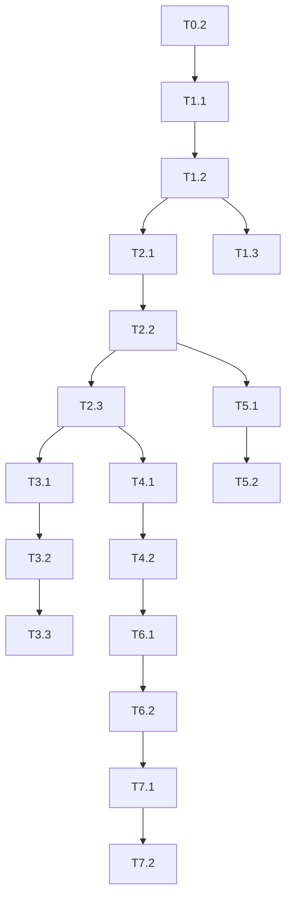

# Migration Plan: Consolidate `agent-runtime` & OpenAI Agents SDK Integration

**Objective**  
Ship a single‑container API (NestJS + Python runner) that exposes `/run` without gRPC, streaming tokens from the OpenAI Agents SDK.

---

## 🗂️ Work Breakdown Structure

| ID | Task | Path / File(s) | Owner | Est. (h) | Dep. | Acceptance Criteria |
|----|------|----------------|-------|----------|------|---------------------|
| **P0 – Preparation** |||||||
| T0.1 | Create `feature/agent-sdk-integration` branch & draft PR | n/a | SE | 0.5 | – | PR opened, CI green |
| T0.2 | Read current code (`structure.md`) and map all references to `agent-runtime` gRPC client & Celery | `/agent-runtime`, `/api/**/agent-runtime*.ts`, `/api/queues/*` | SE | 2 | – | Inventory document attached to PR |
| **P1 – Python Runner inside API** |||||||
| T1.1 | Create folder `api/python/` + virtual‑env & `requirements.txt` | `api/python` | SE | 1 | T0.2 | Python venv with `openai-agents` installs locally |
| T1.2 | Add `agent_runner.py` (minimal JSON stdin/stdout streamer) | `api/python/agent_runner.py` | SE | 2 | T1.1 | Script streams “hello” chunk back in unit test |
| T1.3 | Unit tests for `agent_runner.py` with pytest & `--asyncio-mode=strict` | `api/python/tests/` | SE | 1 | T1.2 | `pytest` passes in CI |
| **P2 – Node ↔ Python Bridge** |||||||
| T2.1 | Implement `runAgentPython` wrapper (child_process) | `api/src/common/python/agent-python.client.ts` | SE | 2 | T1.2 | Wrapper returns Observable chunks in jest test |
| T2.2 | Add RxJS integration in `AgentService.run()`; feature flag `USE_PYTHON_BRIDGE` | `api/src/agent/services/agent.service.ts` | SE | 2 | T2.1 | `/run` streams “pong” from python in e2e test |
| T2.3 | Deprecate gRPC stub injection (`AgentRuntimeClient`) | `api/src/**/agent.grpc.*` | SE | 1 | T2.2 | No import `@grpc/grpc-js` in API code |
| **P3 – Clean up legacy micro‑services** |||||||
| T3.1 | Delete `agent-runtime` NestJS project | `/agent-runtime` | SE | 0.5 | T2.3 | Folder removed, no CI jobs |
| T3.2 | Delete Python Celery runner service | `/agent-runtime-runner` | SE | 0.5 | T3.1 | Folder removed |
| T3.3 | Remove Celery/RabbitMQ docker‑compose blocks; keep BullMQ if >60 s jobs | `/docker-compose*.yml` | SE | 1 | T3.2 | `docker compose up` starts single `api` service |
| **P4 – Docker & Environment** |||||||
| T4.1 | Write multistage Dockerfile (Node build → Python slim) | `api/Dockerfile` | SE | 2 | P1 | `docker image build` succeeds locally |
| T4.2 | Update `.dockerignore` & `compose.yaml` to expose 8000 | root | SE | 0.5 | T4.1 | `docker compose up` streams tokens |
| **P5 – Tests & Observability** |||||||
| T5.1 | Update e2e tests (`app.e2e-spec.ts`) to expect stream from bridge | `api/test/` | SE | 1 | P2 | Tests green |
| T5.2 | Add Prom metrics: `agent_python_seconds_total`, histogram | `api/src/metrics/` | SE | 1 | P2 | Metric visible at `/metrics` |
| **P6 – CI/CD** |||||||
| T6.1 | Amend GitHub Actions matrix: add `python-version: [3.11]` | `.github/workflows/` | DevOps | 1 | P1 | CI passes |
| T6.2 | Remove `agent-runtime` image build & deploy steps | `.github/workflows/`, `k8s/*.yaml` | DevOps | 1 | T3.1 | Only `api` image deployed |
| **P7 – Documentation** |||||||
| T7.1 | Update `README.md` root & `/api/README.md` with new flow diagram | docs | SE | 1 | All | Docs describe single‑service |
| T7.2 | Write migration guide & rollback procedure | `docs/migration_agent_runtime.md` | SE | 2 | All | Guide reviewed by TL |

_Total est. effort: **21 hours (~3 PD)**_

---

## 🔄  Task Flow Diagram

---

## ✅  Definition of Done

1. `POST /run` streams OpenAI tokens end‑to‑end locally & in staging.
2. Repo contains no reference to `agent-runtime` gRPC or Celery.
3. Single `api` image builds < 300 MB and boots < 6 s.
4. All unit, e2e and CI checks pass.
5. Observability dashboards (Grafana) display new metrics.
6. README & migration guide approved by Tech Lead.

---

*Reference file:* project tree snapshot — *structure.md* citeturn0file12

