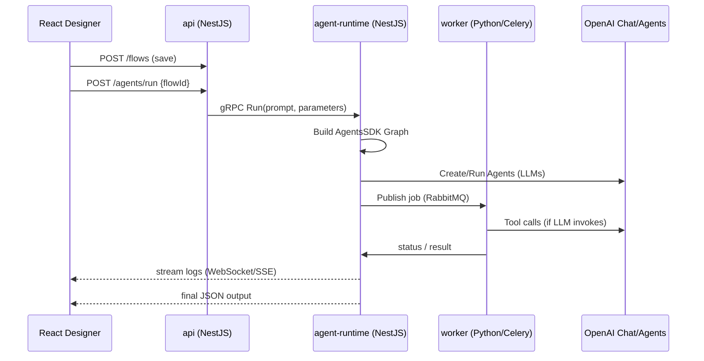

# AgentFlow – Workflow & Architecture Report

> **Objectif** : expliquer le rôle de `agent-library`, décrire l’intégration de l’OpenAI **Agents SDK** dans `agent-runtime`, puis détailler le chemin d’exécution complet lorsqu’un utilisateur conçoit un agent et clique sur **Run**.

---

## 1. `agent-library` : à quoi ça sert ?

| Dossier | Rôle | Technologie |
|---------|------|-------------|
| `agent-library/src/blocks` | **Catalogue de Blocks** : composants réutilisables (InvoiceExtractor, EmailClassifier, Summarize…) décrits de façon **isomorphe** (mêmes métadonnées côté front & back). | TypeScript |
| `agent-library/src/client` | **CrewRuntimeClient** & **S3Service** : helpers qui parlent à l’API ou stockent artefacts. | TypeScript |

### Pourquoi ?
1. **Single-source-of-truth** : un Block déclaré ici est instantanément disponible :
   * dans le **Flow Designer** (React) pour que l’utilisateur le glisse-dépose ;
   * dans `agent-runtime` pour valider les nœuds et générer le JSON/Tools associé.
2. **Typing partagé** (ts-paths) : zéro divergence de signature.
3. **Test unitaire** dans `.spec.ts` pour garantir un **output JSON strict** (cf. mémoire 63fc84…)

---

## 2. Intégration de l’OpenAI Agents SDK dans `agent-runtime`

| Élément | Fichier | Fonction |
|---------|---------|----------|
| **gRPC Controller** | `agent-runtime/src/controllers/agent.grpc.controller.ts` | Reçoit un **stream** `RunRequest` (prompt + params) ↔ renvoie un **token** & évènements de progression. |
| **Service** | `agent-runtime/src/services/agent.service.ts` | 1) construit la boucle d’agent via `AgentsSDK` ; 2) publie des évènements (RabbitMQ) ; 3) persiste telemetry. |
| **Python Worker** | `worker/agentflow_worker.py` | Consomme la queue, exécute réellement les Tools (extractions, API externes…) → renvoie états. |



---

## 3. Étapes détaillées “de Run à Résultat”

1. **Conception (Front-end)**
   - L’utilisateur assemble des Blocks (issus de `agent-library`) dans le Flow Designer.
   - Le flow est sérialisé en DSL JSON (stocké via API).

2. **Lancement (API Gateway)**
   - `POST /agents/run` → API valide le JSON via les schémas de `agent-library` puis transmet le *prompt* + *params* à `agent-runtime` (gRPC).

3. **Orchestration (`agent-runtime`)**
   1. `AgentService` traduit chaque Block ➜ **Tool** pour l’Agents SDK (auto-schema).
   2. Crée un **Agent** master avec :
      - **instructions** globales,
      - la **toolset** générée,
      - éventuels **guardrails** (pydantic/zod).
   3. Monte un **Handoff** pour déléguer : ex. `extract_invoice` → agent "DataExtractor".
   4. Lance `agent.run(prompt)` (AgentsSDK) et **stream** les tokens vers le Controller.

4. **Exécution Worker (Python)**
   - Si un Tool exige un appel long (OCR, FEC parsing…), l’Agents SDK publie `call()` → wrapper RabbitMQ. Le **worker** exécute puis répond.

5. **Retour & Télémetrie**
   - Chaque étape est tracée (OpenTelemetry) ; `RT` stocke dans PostgreSQL et diffuse via WebSocket `/logs/:token`.
   - À la fin, l’output (strict JSON) est envoyé au front et affiché.

---

## 4. Vue d’architecture globale

```ascii
┌───────────────────────┐   wss/rest          ┌────────────┐
│   React 18 SPA        │◀────────────────────│   api      │
│  Flow Designer        │   JSON DSL          │  NestJS    │
└──────────▲────────────┘                     └────┬───────┘
           │gRPC                                   │gRPC
┌──────────┴────────────┐               telemetry │stream
│  agent-runtime        │◀────────────────────────┘
│  NestJS + Agents SDK  │ publish               ▲
└──────────┬────────────┘   RabbitMQ            │ results
           │                                   ┌─┴─────────┐
           │   Celery task / Tool execution    │ worker    │
           └──────────────────────────────────▶│ Python    │
                                               │ FastAPI   │
                                               └───────────┘
```

---

## 5. Road-map (MVP)

1. **Phase 1** : exposer un **PoC** `POST /agents/run` qui retourne un résumé (SummarizeBlock) → done 💡.
2. **Phase 2** : générer automatiquement la toolset AgentsSDK à partir d’un flow JSON.
3. **Phase 3** : brancher RabbitMQ + Celery Worker pour out-of-process Tools.
4. **Phase 4** : historiser les runs, quotas, facturation (voir `telemetry/pricing.service.ts`).

---

*Rédigé : 27 avril 2025 — contact : core team AgentFlow*
